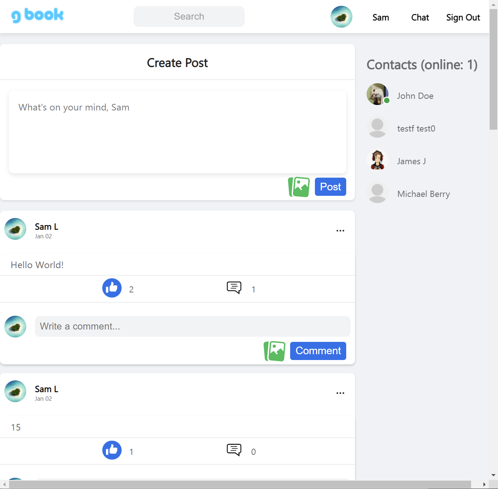

# OdinBook server

# Description

    OdinBook server for a social web application.

[<h2>Live Demo</h2>](https://samgliu.github.io/Odinbook-Client/)

# Repositories

Server repository: https://github.com/samgliu/Odinbook-Server  
socket.io server: https://github.com/samgliu/Odinbook-socketio-server  
Server API Demo: https://odinbook-server-production.up.railway.app

Client repository: https://github.com/samgliu/Odinbook-Client  
Client Demo: https://samgliu.github.io/Odinbook-Client/

# Built With

- Node.js
- Express
- passportJS
- mongoDB
- socket.io
- multer

# Feature:

- Sign up/in/out
- Post/Comment/Like (add/delete with picture)
- Friend with other users
- Profile and Avartar Edit
- Real time chatting system with notifications
- responsive view
- Infinite scrolling posts
